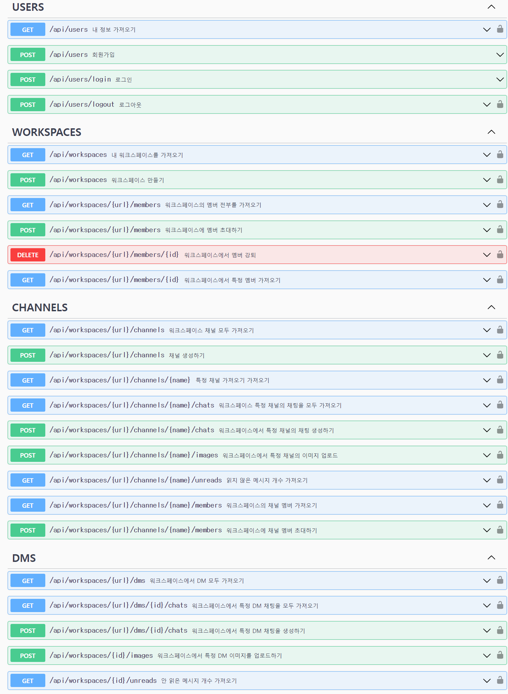
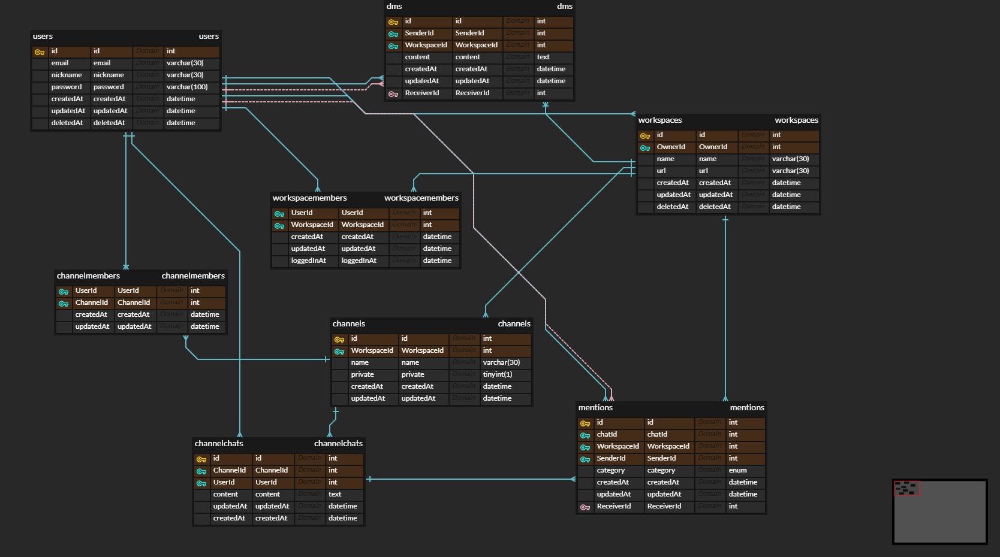

# Project structure 🏗

## API 설계

REST API의 장점은 HTTP 프로토콜 인프라를 그대로 사용하는 것입니다. 설계의 목표는 HTTP Method를 활용하여, 현재 사용하고 있는 자원을 직관적으로 알 수 있게 설계하는 것입니다. 따라서 URL을 보고 현재의 상황을 파악할 수 있게 작성하였으며, HTTP의 자원을 효율적으로 활용 하고 싶기 때문에, 각각의 계층을 파라미터로 구성하였습니다.

Slack의 핵심은 워크스페이스 자원을 필두하는 계층적 구성입니다. 따라서 유저에 대한 부분과 워크스페이스에 대한 부분으로 크게 나누었고, 워크스페이스의 하위 계층에 해당하는 부분들을 표현하여, 직관성을 높이려는 노력을 하였습니다. 

## ERD 

Entity들과의 관계를 효과적으로 표현하고 싶어서 ERD를 첨부했습니다.